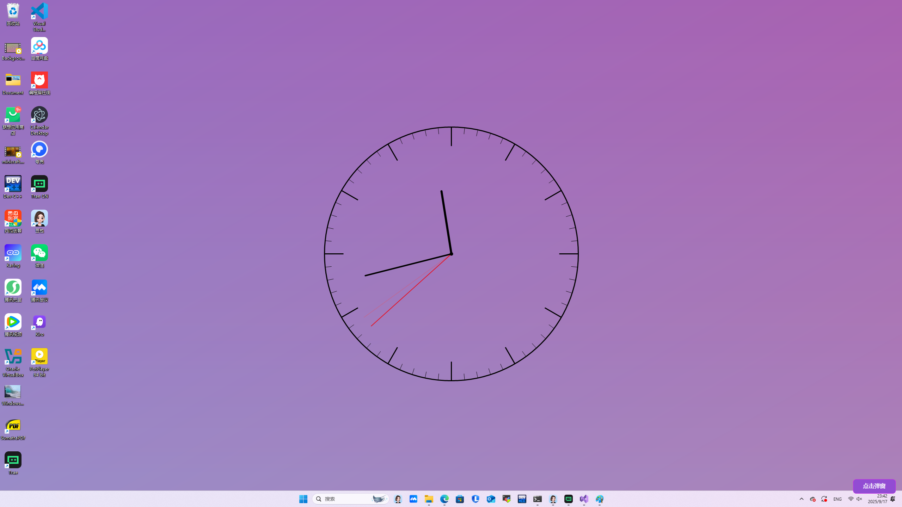

# Interactive Wallpaper with Button

一个 C# WinForms 应用程序，可以创建带有实时时钟的动态桌面壁纸，并在桌面上显示一个透明的交互按钮。

## 截图



## 功能特性

- **动态壁纸生成**：自动生成带有渐变背景和实时时钟的桌面壁纸
- **实时时钟显示**：在壁纸上显示带有时针、分针、秒针的模拟时钟
- **透明交互按钮**：在桌面右下角显示一个半透明的可点击按钮
- **自动更新**：每秒自动更新壁纸以显示当前时间
- **随机背景**：每次更新时生成随机颜色的渐变背景

## 技术实现

- **.NET 8.0** - 基于最新的 .NET 框架
- **Windows Forms** - 用于 GUI 界面
- **GDI+** - 用于图形绘制和壁纸生成
- **Windows API** - 用于设置系统壁纸和窗口透明效果

## 系统要求

- Windows 操作系统
- .NET 8.0 Runtime
- 支持 Windows Forms 的环境

## 安装和运行

### 从源码构建

1. 克隆仓库：
```bash
git clone https://github.com/buld-your-own-x-with-ai/Backgroundv.git
cd Background
```

2. 使用 Visual Studio 或 .NET CLI 构建：
```bash
dotnet build
```

3. 运行应用程序：
```bash
dotnet run --project Background
```

### 直接运行

双击 `Background.exe` 文件即可启动应用程序。

## 使用说明

1. **启动程序**：运行应用程序后，桌面壁纸会立即更新为带有时钟的动态背景
2. **交互按钮**：在桌面右下角会出现一个蓝色的"测试按钮"
3. **点击按钮**：点击按钮会显示当前时间的消息框
4. **退出程序**：使用 Ctrl+C 或关闭控制台窗口来退出程序

## 项目结构

```
Background/
├── Background.sln          # Visual Studio 解决方案文件
├── Background/
│   ├── Background.csproj   # 项目配置文件
│   ├── Program.cs          # 主程序入口和核心逻辑
│   ├── Form1.cs           # Windows Forms 相关文件
│   ├── Form1.Designer.cs  # 窗体设计器文件
│   └── Form1.resx         # 资源文件
└── README.md              # 项目说明文档
```

## 核心组件

### WallpaperManager 类
- 负责生成和设置动态壁纸
- 绘制渐变背景和实时时钟
- 管理临时文件的创建和清理

### TransparentButtonForm 类
- 创建透明的全屏窗口
- 在右下角显示可交互的按钮
- 处理鼠标事件和按钮点击

## 开发特性

- **内存管理**：自动清理临时壁纸文件
- **异常处理**：完善的错误处理机制
- **性能优化**：使用 GDI+ 进行高效的图形渲染
- **用户体验**：平滑的按钮悬停效果和圆角设计

## 贡献

欢迎提交 Issue 和 Pull Request 来改进这个项目。

## 许可证

本项目采用开源许可证，具体请查看 LICENSE 文件。

## 远程仓库

项目托管在 GitHub：https://github.com/buld-your-own-x-with-ai/Background
